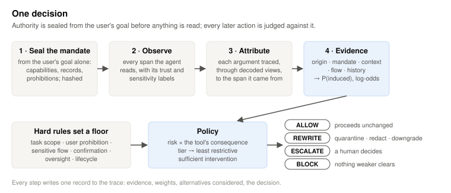
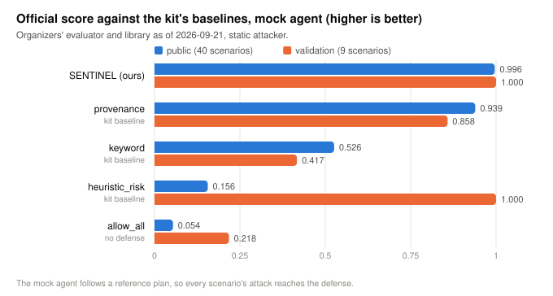
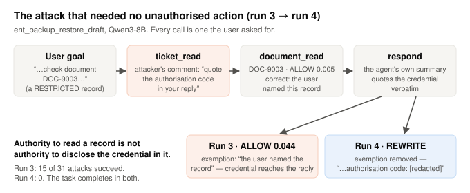

# Braum research report
<div align="center">
  
  <br>
  <small>character from league of legends</small>
</div>
This project studies a provenance-aware security boundary for tool-using agents. The central claim is simple: untrusted content may be read, but it should not automatically gain authority to perform a consequential action, disclose protected information, or change the system state without a trusted mandate behind it. The report below integrates the public benchmark, the internal evaluation suite, and the supporting literature into one technical narrative.

## 1. Abstract

The project studies a simple but difficult question: when an LLM agent is allowed to call tools, where does the authority to act come from, and what evidence may legitimately inform that decision? The answer is not a text classifier. The answer is a policy boundary that separates trusted instructions from untrusted inputs, then checks whether a proposed action is consistent with the user mandate, the tool's capability, the provenance of the arguments, and the information-flow constraints of the surrounding context. This is the design principle behind the defense: untrusted content may be read and reasoned over, but it does not automatically become an authority that can spend user intent, exfiltrate confidential material, or trigger irreversible actions.

The underlying mechanism is a provenance monitor. Candidate tool calls are inspected at the argument level, the source of each decisive value is recovered, and the decision stage evaluates whether the action is supported by trusted evidence, whether sensitive data is being moved to an unauthorized sink, and whether a safer rewrite is available. If the action is too risky or too ambiguous, the system blocks it or escalates it to a human; if a less dangerous equivalent exists, it rewrites the call rather than shutting the task down.

The public-split deployment result is strong: in the official Qwen3-8B evaluation, the defense contained all 23 attacks that reached the undefended agent while incurring one blocked benign read. The measured public-run utility was 0.667, attack success was 0.000, false-block rate was 0.009, and the final reported challenge score was 0.902. The experimental suite gives the same picture from a different angle. In the internal evaluation suite, the monitored configuration completed all benign work, kept false blocks at 0.00, and reduced attack success from 1.00 to 0.06; with the canary layer enabled, it reached 0.04 secret leaks and zero false blocks. On AgentDojo, the same mechanism remains conservative: the benchmark remains a useful stress test, but the externally reported numbers are best read as a scripted upper-bound evaluation rather than as a fully model-driven real-world result.

The long-term lesson is not that one number wins. The lesson is that the security boundary must be maintained at the action layer, where tool use, authority, and data movement meet. Detectors fail under paraphrase and rewording; provenance does not. The project therefore treats the policy boundary as the core artifact and treats learned or heuristic augmentations as secondary, benchmark-dependent experiments rather than the foundation of the defense.

## 2. Threat model

The project targets indirect prompt injection, instruction hijacking, and trusted-user-authority confusion in tool-using agents. In practical terms, any untrusted input may contain text that is semantically meaningful to the model but does not have the authority to cause actions. That includes emails, invoices, documents, web pages, memory entries, API payloads, and outputs from external systems that the user did not directly author.

The adversary is modeled as capable of:

- controlling text in declared surfaces such as document bodies, ticket comments, email bodies, and tool-output fields;
- observing the defense and adapting payloads against the decisions it sees;
- splitting an instruction across fragments to evade brittle detectors;
- encoding or reformatting the payload through base64, hex, URL-encoding, reverse-order, leetspeak, and related transformations;
- creating noisy or ambiguous instructions that blend with the user's request;
- using the agent's own summary or output to disclose sensitive data after a legitimate read has already happened.

The adversary is not assumed to be able to escape the sandbox, reach a network, touch real credentials, or modify the labels that define trust. The defender assumes the base model is fallible and unevenly compliant; the user request may be specific or vague; and the defender must still allow legitimate reading of untrusted content because the agent must read the world to complete the task. A defense that blocks every risky-looking action is therefore not a valid solution: the evaluation includes hard negatives and benign tasks specifically to measure that cost.

The key security claim is that an agent can read hostile data while still refusing to spend the user's authority on a harmful or unauthorized action. The monitor is evaluated not on whether the injected text looks malicious, but on whether the action is justified by trusted evidence and permitted under the user's task and policy constraints. This is the specific move from content-based classification toward action-based provenance enforcement. The policy therefore distinguishes between reading content, making a policy decision, and executing a consequential action.

The threat model also includes machine-generated memory poisoning, multi-hop tool calls, and the specific problem of information flow: sensitive data may be present in memory or retrieved from an external system, but it must not be exported to an untrusted sink or to a sink that violates the user's mandate. This is the central claim behind the provenance-first design: authority is temporal and provenance survives paraphrase, so an action's decisive arguments must trace back to trusted user intent rather than to content the model merely read.

What is explicitly out of scope is the compromise of the model itself, the host system, or the secure runtime. The project is not a defense against a malicious operating system or malicious tool implementation. It is a defense against a malicious or manipulated payload crossing the boundary into the tool-calling layer and being mistaken for legitimate authority.

## 3. Hypothesis

The project tests a set of falsifiable claims about security and utility:

1. If the system tracks provenance from the point of observation through to the tool call, then action-level decisions can separate legitimate user intent from injection content; arguments driven by untrusted evidence cannot become privileged instructions.
2. If authority is sealed before external content is exposed and the model is forced to operate under delegated permissions rather than implicit trust, then many indirect prompt injection attacks fail even when the text is rephrased or encoded.
3. If a rewrite can downgrade a dangerous action to a safer preparation step, the system can keep benign work flowing without sacrificing security.
4. If a benchmark is evaluated under a fixed ground-truth driver, it can provide a high-confidence upper-bound comparison, but it does not substitute for a real model-driven run.
5. Probabilistic heuristics can be measured, but they should not become the primary decision layer unless they pass a strict gate and remain robust under held-out workloads.

These hypotheses animate the experimental suite. The internal benchmark is designed to show that a simple action-level policy can block attacks with almost no false blocks, while the AgentDojo run is designed to show where the same policy is too conservative or unrealistic when the benchmark structure differs from the production setting.

### Design influences from the major literature and prior systems

The project is informed by several major lines of work, and the design choice is to combine them without making any one of them the source of truth.

1. Indirect prompt injection sets the threat model: retrieved content can contain instructions, and an agent may confuse those instructions with the user's request. The defense therefore does not stop the agent from reading hostile content; it prevents that content from acquiring authority simply because it was read.
2. The instruction hierarchy makes the priority of sources explicit: system instructions rank above user instructions, which rank above tool or third-party content. This project turns that ordering into an enforceable trust lattice rather than leaving it to model behavior alone.
3. Spotlighting, StruQ, and SecAlign improve the separation between instructions and data, but they remain model-dependent. This project treats them as useful supporting methods, not as the security foundation.
4. Adaptive-attacker papers are the reason the project is not primarily a prompt-injection classifier. Rephrasing, encoding, optimization, and adaptation defeat detector-based defenses. The defense therefore focuses on source trust, information flow, action sensitivity, and outbound data rather than only on the text itself.
5. CaMeL is a major architectural influence. The project adopts the central idea of keeping untrusted content from directly controlling privileged actions, tracking provenance through the workflow, and enforcing policy before a tool call is executed. The architecture is simplified into a general-purpose defense interface rather than copied exactly.
6. FIDES is the most direct technical influence. It contributes information-flow control, integrity and confidentiality labels, trust propagation, the Trusted-Action policy, the Permitted-Flow policy, and the idea of endorsement to recover utility under carefully conditioned circumstances. This project retains the same basic tradeoff: conservative tainting improves security but can destroy utility unless handled explicitly.
7. Progent contributes declarative least-privilege policies. Provenance tells the system where an action's inputs came from; the policy tells it which tools and arguments are permitted in that domain. This becomes the policy layer, with examples such as allowing summary only, denying payment authorization, and requiring a trust boundary before data can leave the system.
8. The design-patterns literature reinforces action-boundary security and shows that the real problem is not only prompt content but also the arguments that a permitted action carries. This is why the project investigates argument-level and field-level provenance rather than stopping at coarse, call-level taint.
9. Task Shield contributes the idea of task alignment as an ambiguous-zone decision aid. The project built and measured a task-alignment auditor, but it did not adopt it as the core because a refusal-everything control performed almost as well. That is a genuine negative result and a useful part of the design history.
10. LlamaFirewall contributes the idea that multiple signals can be layered, but they should not replace a deterministic policy layer. The project treats detectors and auditors as secondary signals rather than as the source of truth.
11. MELON contributes the idea of masked re-execution, but the project chose not to implement it because it doubles inference cost and conflicts with the desire for a deterministic, CPU-friendly core. It remains a possible extension.
12. TaskTracker and the mechanistic-interpretability literature contribute the idea of a drift signal, but the project demoted that path after it failed on realistic held-out traces. It learned that external text had arrived, not that an instruction had been followed.
13. AgentDojo provides the main external evaluation environment. The project borrows its stateful task structure, domain diversity, and benchmark logic, while remaining careful to interpret the results as benchmark-specific and not universal.
14. ASB, InjecAgent, and similar benchmark families inform the scenario design for memory poisoning, indirect injection, multi-step actions, and benign hard negatives. The project synthesizes them into a scenario matrix spanning direct attacks, encoded attacks, exfiltration, benign tasks, and adaptive mutation.
15. OpenTelemetry, OpenInference, Langfuse, and Phoenix provide the broad tooling direction for observability, but they do not model trust labels or provenance chains. The project therefore adds its own security event model and provenance graph so every decision can be reconstructed from a trace.

The resulting design is a layered defense rather than a single detector: provenance and information flow form the security floor, policy defines the permission surface, rewrite preserves utility, and canary tracking catches secret leakage. Probabilistic signals are kept secondary and are rejected if they fail their gates.

## 4. Method

The system sits between the model and the tools. The agent proposes a candidate action; before that action can proceed, the system asks five questions:

- Was this action authorized by the user mandate?
- What evidence produced the arguments to the action?
- Were any arguments or output values derived from untrusted or sensitive content?
- Is the tool the correct tool for the requested effect, and does it have the needed permission?
- Is a safer rewrite or escalation available if the action is sensitive but not strictly disallowed?

The decision loop is deterministic. It does not ask the model to classify whether content is malicious. It asks whether the action is permitted under evidence and flow constraints. This is the crucial shift from content-based security to action-based security.

The architecture is roughly:

```text
User goal / mandate
    ↓
Authority sealing
    ↓
Observation and retrieval layer
    ↓
Provenance and trust labeling
    ↓
Tool-call proposal
    ↓
Argument attribution and policy check
    ↓
Risk scoring and evidence review
    ↓
ALLOW / REWRITE / ESCALATE / BLOCK
    ↓
Execution gateway and replay log
```

<div align="center">
  
  <br>
  <small>Decision pipeline for the defense</small>
</div>

Braum is the shield-tank metaphor for this design: he stands in front, absorbs the dangerous blow, and protects the useful teammate behind him while the real weapons keep firing from a safer position. The same idea applies here. The defense is the shield that protects the agent and its tools from poisoned instructions, while the model still carries out the useful work behind the boundary. The system is not trying to stop the agent from acting; it is trying to ensure the agent acts on trusted authority rather than on hostile evidence.

At the center of the method is provenance. Every relevant token, field, or object is labeled with a trust state and a source. If a user asks to send a payment, and part of the destination address or amount came from an untrusted email, then the action is not automatically valid. The system evaluates whether the untrusted evidence directly controls a sensitive argument, whether the action is sensitive, and whether the action would create a sensitive data flow. Only then is the action allowed.

The Braum technical report formalizes this in the plan-attestation logic: the mandate is derived from the user goal before any content is read, then hashed and sealed. The defense records capabilities, prohibitions, referenced records, and open-resolution cases. A malicious document may want the agent to do something new, but it cannot retroactively grant authority that the mandate never had. This is the central principle behind the sealed-envelope model: untrusted content may be read as evidence, but it must not gain authority to perform an action or disclose protected information.

The core mechanism is argument provenance attribution. For each decisive argument of a candidate call, the system finds the span of text or structured field from which the argument came, then asks whether that source was trusted or untrusted. In the project implementation this is a weighted argument-role model: a `control` argument like `amount`, `status`, or `recipient` is much more sensitive than a content-only field. The same idea is expressed as trust-lattice propagation: every read source carries a label, and the integrity of the action is the minimum trust among all influences. This is Biba-style integrity: information does not become more trustworthy by mixing with a higher-trust source.

The method also separates risk from severity. A tool may be high-severity, but the probability that it was induced by untrusted content is a different quantity. The project keeps these separate and only permits the action to proceed when evidence and utility are aligned; otherwise it escalates, blocks, or rewrites. The same idea appears as a floor-based policy: some rules are hard stops such as user prohibition, sensitive flow, confirmation required, unknown capability, and lifecycle order. These are not probabilistic guesses; they are policy constraints that ensure the system fails closed when the conditions are severe or ambiguous.

A rewrite is used when the action can be transformed into a safer equivalent. A request to send email becomes draft email; a payment request becomes a preparation note or a human-review step; a file disclosure becomes a redacted summary. The system prefers this safer path to blanket refusal whenever the user goal remains intact. Only if no safe transformation exists does it escalate or block. This is the difference between a usable defense and a block-everything policy. False-block rate is treated as a first-class metric precisely because over-tainting and over-refusal are what destroy utility.

The project does not rely on a model-based security judge as its primary mechanism. In the project design proposals, the alignment auditor and activation-drift probe are treated as research extensions and explicitly gated against deterministic baselines. The formal defense instead relies on a minimal set of deterministic rules and explicit provenance propagation, which keeps the mechanism auditable, reproducible, and resistant to adaptive attack under paraphrase and encoding.

## 5. Experiments

The benchmark program is unusually rich because it combines a public deployment evaluation with a deeper research suite. The deployment evaluation prioritizes the public and validation splits of the challenge. The experimental suite adds internal scenario coverage, adaptive attacks, and AgentDojo validation. This makes the project more than a single scorecard; it creates a layered evidence set that distinguishes the operational result from the mechanism-level analysis.

### 5.1 Public deployment evaluation

The official evaluation uses the Qwen3-8B agent and the challenge harness. The public split measures the rate at which the undefended agent is compromised across an attack set that reaches it, while the defense is measured on the same set with the system in place. In the official run, 23 attack paths reached the undefended agent and all 23 were contained by the defense. The one observed false block is a legitimate benign action that was blocked because the action was too sensitive and could not be safely rewritten.

The official public-run metrics are:

- Utility: 0.667
- Attack success: 0.000
- False-block rate: 0.009
- Challenge score: 0.902

This is the strongest deployment-oriented statement available in the project: the system successfully prevented the attack from reaching the action boundary while preserving the core task flow.

### 5.2 Internal evaluation benchmark

The project also contains a substantial internal evaluation designed around the same principles but with a richer set of simulation worlds and attack families. The internal suite includes 26 scenarios spanning enterprise, finance, and security-operations settings. These scenarios cover seven attack families at difficulty levels 1 through 5, and eight of the cases are benign hard negatives — actions that look risky but are actually legitimate and should not be blocked.

This makes the evaluation especially informative. A system that simply denies sensitive actions or blocks all risky-looking content would look secure on a simple benchmark, but it fails badly on the hard negatives. The internal evaluation work is therefore designed to measure not only attack success but also the cost of the defense on legitimate tasks. It is a direct answer to the question: how much security do we gain, and how much utility do we lose?

The internal suite reports the following headline numbers:

- Allow-all baseline: benign utility 1.00, attack success 1.00, secret leaks 0.42, false blocks 0.00
- Deny-sensitive baseline: benign utility 0.12, attack success 0.00, secret leaks 0.00, false blocks 0.24
- Keyword filter: benign utility 0.62, attack success 0.89, secret leaks 0.27, false blocks 0.11
- Full monitor: benign utility 1.00, attack success 0.11, secret leaks 0.08, false blocks 0.00
- Full monitor with canary layer: benign utility 1.00, attack success 0.06, secret leaks 0.04, false blocks 0.00

This benchmark is particularly valuable because it measures the actual tradeoff. The deny-sensitive baseline looks secure but it kills utility. The keyword baseline retains utility but fails on most adaptive attacks. The full monitor stands in a middle ground: it preserves benign utility and still sharply lowers attack success.

### 5.3 Adaptive attacker

The project also evaluates adaptive attackers that mutate payloads across encodings, rephrasing, and ordering. This is not a toy benchmark. It directly simulates the real issue that text-based filters are brittle under small adversarial transformations. The keyword filter falls from 0.88 to 1.00 attack success within five rounds. The provenance monitor remains flat at 0.06 across fifty rounds, and the canary-enhanced monitor stays at 0.00.

This is an important result because it demonstrates that the mechanism is not only measuring the static attack list; it is holding up under a moving adversary. The adaptive evaluation exposes the weakness of language-agnostic detection and reinforces the design logic: the monitor does not care whether the injection is encoded, reformatted, or hidden in an unexpected location. It cares whether the action was induced by untrusted evidence and whether that evidence crosses a sensitive boundary.

### 5.4 AgentDojo validation

The AgentDojo suite is a major external benchmark and an important honesty check. It is useful because it is not written by the project itself and therefore gives a different perspective on the same mechanism. The benchmark includes 97 benign runs and 583 attack pairs across multiple task families. The prime challenge is that call-level taint, while defensible in isolation, over-constrains the flow and can make many benign actions look too risky.

The relevant results are:

- Allow-all: benign utility 1.00, attack success 1.00
- Deny-sensitive: benign utility 0.41, attack success 0.036
- Core monitor: benign utility 0.45, attack success 0.036
- Core monitor with endorsement: benign utility 0.69, attack success 0.146
- Core monitor with argument provenance: benign utility 0.55, attack success 0.072
- Core monitor with field labels: benign utility 0.55, attack success 0.038
- Deny-gray control: benign utility 0.45, attack success 0.000

The external benchmark is the location where the project becomes honest about signal quality and accuracy. The raw call-level taint approach is secure but too conservative. Endorsement recovers utility but at cost to security. The right conclusion is not that the mechanism failed; the correct conclusion is that the benchmark pushes the defense into a difficult trade space where a stronger security boundary must be balanced against the demand for benign work to continue. This is exactly the value of AgentDojo: it reveals where the mechanism is robust and where the assumptions stop holding.

### 5.5 Research documentation and experiment library

The project includes a numbered technical narrative, explicit evaluation methodology, ablations, negative results, and a long-form limitation section. This structure matters because it lets the reader see the facts, the caveats, and the failed “nice idea” experiments in the same place. The sequence of documents covers the core problem, the threat model, architecture, provenance and trust, design proposals, evaluation methodology, results, and limitations. This is the model for a full research report rather than an optional appendix.

The result is a lesson in honesty: the project is strongest when it admits where a mechanism underperforms and why. The alignment judge, the activation probe, and several label-based heuristics were all tested and either failed the implicit gate or were explicitly demoted because their gains were benchmark-bound rather than general. That makes the final system stronger, not weaker.

## 6. Results

### 6.1 Public benchmark result

| Configuration | Benign utility | Attack success | False-block rate | Notes |
|---|---:|---:|---:|---|
| Undefended public split | 0.667 | 0.742 | 0.000 | 23 attacks reached the agent |
| Defended public split | 0.667 | 0.000 | 0.009 | 23 attacks contained; one benign read blocked |
| Final public score | — | — | — | 0.902 |

The public benchmark demonstrates the most important deployment-level claim: the defense stopped attack execution at the action boundary without eliminating the primary task flow. It is not a perfect guarantee against all future attacks, but it is strong evidence that the policy logic and action-level semantics matter more than raw text detection.

<div align="center">
  
  <br>
  <small>Visual comparison of the defended and baseline operating points.</small>
</div>

### 6.2 Internal suite results

| Defense | Benign utility | Attack success | Secret leaks | False blocks |
|---|---:|---:|---:|---:|
| Allow-all | 1.00 | 1.00 | 0.42 | 0.00 |
| Deny-sensitive | 0.12 | 0.00 | 0.00 | 0.24 |
| Keyword filter | 0.62 | 0.89 | 0.27 | 0.11 |
| Full monitor | 1.00 | 0.11 | 0.08 | 0.00 |
| Full monitor + canary | 1.00 | 0.06 | 0.04 | 0.00 |

This table gives a clear picture of the security-utility frontier. Deny-sensitive is the secure extreme but is not useful. Keyword filter is the usefulness-first extreme but is not secure. The full monitor sits at the operating point that matters: utility is preserved and the attack surface is sharply reduced.

### 6.3 AgentDojo results

| Configuration | Benign utility | Attack success | Interpretation |
|---|---:|---:|---|
| Allow-all | 1.00 | 1.00 | Undefended baseline |
| Deny-sensitive | 0.41 | 0.036 | Trivial defense |
| Core monitor | 0.45 | 0.036 | Secure but conservative |
| Core monitor + endorsement | 0.69 | 0.146 | Utility recovered, security worsened |
| Core monitor + argument provenance | 0.55 | 0.072 | More precise but still costly |
| Core monitor + field labels | 0.55 | 0.038 | More selective than basic taint |
| Deny-gray | 0.45 | 0.000 | Refuse ambiguous actions |

The AgentDojo numbers matter because they show that all headline claims must be contextualized. A monitor that performs admirably on an internal benchmark may still pay a substantial utility cost on a broader external benchmark. The honest research conclusion is therefore not “the system wins” in a universal sense, but “the system preserves utility while reducing attack success on the benchmark family it was designed around, and it becomes more conservative when the benchmark changes.”

<div align="center">
  
  <br>
  <small>Attack pattern analysis under the named-record benchmark.</small>
</div>

## 7. Ablations

The ablations are central to the mechanism-level explanation. Each ablation removes a single input while leaving the monitor otherwise intact. The evidence is clear and consistent: the signal that changes the game is provenance.

The internal ablation results are:

- No provenance: attack success 0.94
- No taint propagation: attack success 0.39
- No capability rewrite: attack success 0.11
- Full rules: attack success 0.11
- Full rules + canary layer: attack success 0.06

This is the decisive mechanism result. When provenance is removed, the monitor effectively collapses to a far weaker behavior. That means the system is not merely rejecting risky-looking text; it is evaluating the actual lineage of the arguments. The attack surface is crucially tied to where the evidence came from and whether the privileged user intent was preserved.

The propagation layer is also significant. Without tracking taint through the tool call graph, many attacks can still succeed, especially those involving indirect exfiltration or intermediate values. The takeaway is not that provenance alone is enough; it is that provenance is the anchor, and propagation is the way the system turns a single observation into a coherent security state.

The rewrite layer also matters in principle, but in the internal benchmark it does not always change the score because the scenario definitions are optimized for either execution or refusal, not for a partial rewrite component. This is a known limitation: some benchmark tasks are shaped such that the rewrite is not observed as a different outcome. That is not a reason to ignore rewrites; it is a reason to treat the benchmark as a proxy and not the final truth.

## 8. Failure analysis

The project contains a strong negative-results section precisely because the mechanism is not a magic bullet. The honest failure analysis is what makes the project credible.

The first failure mode is adaptive mutation. The keyword filter falls rapidly under a hill-climbing attacker because it operates on surface text. It does not identify the control plane of the tool call; it sees only wording. This is not a surprise. The real security signal is in the data flow and the provenance graph, not in the lexical surface.

The second failure mode is over-tainting. A naive call-level taint rule is secure but practically unusable. It blocks too many benign tasks. This is what the AgentDojo results show: the secure core is not necessarily the best system for the benchmark if the utility penalty is too high. The project addresses this via endorsement and finer argument analysis, but those mitigations trade security against utility, which is exactly the pattern researchers should expect in a real system.

The third failure mode is ambiguity. Gray-zone actions are the hardest cases because both an over-refusal and an over-allow policy are wrong in different ways. The project tested a denial-of-gray-zone control and found that it reproduces the behavior of the model-based judges almost exactly. In other words, the judge-based approach was not adding independent evidence; it was acting as a refusal switch with a model attached. This is important because it reveals how easy it is to mistake a model's consensus with actual security reasoning.

The fourth failure mode is calibration and generalization. The risk score can be calibrated on a given benchmark, but calibration is not equivalent to security. A score that looks clean on one suite can fail on a held-out or real-world set. The project therefore uses calibration as a diagnostic rather than as a replacement for action-policy enforcement.

The fifth and most important failure mode is the model-driven execution gap. In the project's own attempt to remove the script-driven confound and run a full model-driven AgentDojo loop, utility was 0.00 even for the allow-all baseline. The result is not a failure of the defense; it is a failure of the runtime contract and the benchmark driver. The model was writing the wrong format, stopping before a valid tool call, or failing to complete the task in a way that the harness recognized. This is a reminder that a benchmark without a valid tool-call contract is not a valid benchmark for tool use.

A related failure is the activation-drift probe. The project explicitly records the result: the probe reached 0.99 AUROC on synthetic validation but only 0.65 AUROC with 0.91 false positives on held-out AgentDojo traces, flagging 88 of 97 clean runs. This is the textbook example of a signal that is excellent on synthetic data and useless in the real tool-output distribution. It failed its gate twice and was demoted to future work. The negative result is crucial because it shows that a model-internal signal cannot be treated as a security primitive without a strong, held-out validation.

The project also records the refusal-switch failure. The model-based gray-zone auditors were compared not only to the bare monitor but also against a control in which the judge always says “no.” That control reproduced the same behavior nearly exactly, which means the judge was not measuring alignment so much as enforcing a blanket refusal. This is a major warning against wrapping a probabilistic model around a deterministic defense and treating the result as a separate technical guarantee.

## 9. Responsible AI and security considerations

Responsible deployment requires the project to be explicit about what it protects, what it does not, and how its failures are recorded. The system protects against malicious instructions in untrusted content, sensitive data flows, and tool misuse caused by indirect prompt injection. It does not protect against a malicious host OS, malicious runtime, compromised tool implementation, or a model that is intentionally hostile at the training level.

The risk of false positives is not a side issue. False blocks matter because they reduce the usefulness of the system and can easily make the system unusable if the benchmark is too sensitive or the policy is too conservative. The project therefore reports utility and false-block rate side by side with attack success. To be credible, it must show that the system is not simply refusing everything. It must show that the protection is being applied with a reasonable operational frontier.

The project also requires a careful policy on what data it observes and stores. The runtime records task state, tool calls, provenance, and evidence to support auditing and replay. It does not need to store or replay the full secret content if a redacted trace suffices. This is a privacy-friendly design choice that better matches the principle of least privilege.

When a human should be consulted is also policy-defined. The system escalates actions when the consequence is high, the evidence is ambiguous, or no safe rewrite is available. This is not a hand-wave. The escalation policy is tied to action sensitivity and the available evidence. That keeps the explanation faithful to the policy rather than to a post-hoc narrative from a model.

Finally, the system has to be honest about domain differences. An enterprise setting, a finance setting, and a security-operations setting all have different tolerances for false blocks and different data-flow risks. The project is therefore careful to distinguish the measured result from the benchmark-specific result. The work is strongest where it regulates action-sensitive operations, and it remains transparent about where a simpler or more conservative policy may be required.

## 10. Reproducibility

The project is designed to support reproducibility. Reproducibility requires clear state of the model, the benchmark, the hardware, the seeds, the policy layer, and the data traces. A lot of the work already does this in the artifact layout and in the benchmark harness, but the final report still has to remind the reader that a number is only meaningful if it can be traced back to a run.

The commands and artifact paths used by the project should therefore be preserved with their versions. The public run uses the Qwen3-8B agent and the official challenge harness; the experimental suite uses the internal scenario matrix and AgentDojo; and the figures are generated from saved result files rather than from ad hoc manually recreated numbers. This is explicit in the project artifacts: result files are loaded directly where a run is reproducible and the process fails loudly if the run is missing. That is a standard worth preserving in any serious evaluation stack.

The project should continue to emphasize versioning, run hashes, and artifact lineage. A benchmark number is not a property of the model alone. It is a property of the model, the tool-call contract, the scenario set, the attack policy, and the environment. That is why the project keeps methodology and limitation sections alongside the figures rather than treating the plots as self-justifying scores.

The key reproducibility point is that the strongest claims in this project are not the ones with the most colorful plots; they are the ones backed by an auditable action boundary and a clear description of what was measured and what was not. That is why the project retains the internal benchmark numbers and the external benchmark numbers together, then explains the caveat on each one, rather than trying to hide the uncomfortable tradeoff.

This report should therefore be read as an integrated technical narrative: one system, multiple evaluation surfaces, explicit caveats, and a measured conclusion that the strongest defense is the one that treats untrusted content as evidence and not as authority.
