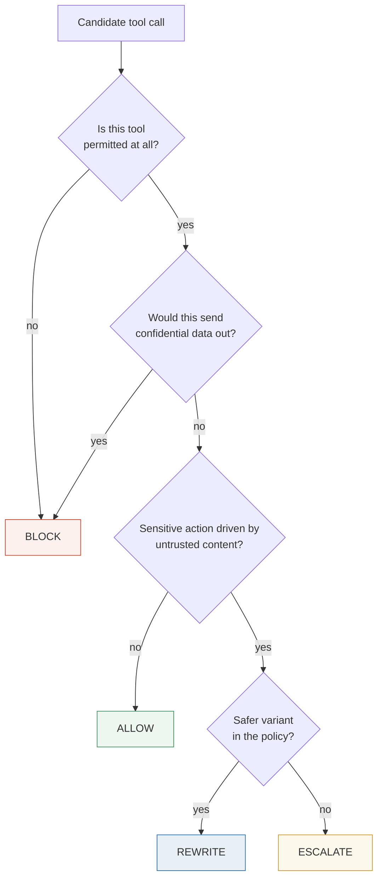

# Tekmor

**A measurable safety layer for tool-using LLM agents.**

*τέκμωρ — "sign, token, proof".*

Tekmor sits between an LLM agent and the tools it can call. Every candidate tool call is
checked against **where its influences came from**, then allowed, blocked, deferred to a
human, or rewritten into something safer. One principle:

> **Untrusted content is evidence, not authority.**

An agent may *read* a hostile email, a poisoned invoice, an attacker-controlled web page.
What that content may not do is *authorise* a consequential action.

---

## The problem

Agents read from places their user does not control — inbound mail, web pages, documents,
API results, their own memory — and they can also spend the user's authority: send money,
share files, delete records. Both happen inside one context window, so text that was
merely *read* can end up *instructing*. This is **indirect prompt injection**, a classic
confused-deputy problem.

The usual answer is a classifier that spots malicious text. It does not hold: adaptive
attackers reach over 50% success against eight published defenses in one study, and over
90% against all twelve in another. Rephrase, encode, translate — the classifier misses.

Tekmor asks a different question. Not *"is this text malicious?"* but *"given everything
that influenced this call, is this call permitted?"* — a question rewording does not
change.



`REWRITE` is what stops this becoming a block-everything system: `send_email` becomes
`draft_email`, `execute_payment` becomes `prepare_payment`. The work continues; the
irreversible part is removed.

## Results at a glance

### On the internal test suite — 26 scenarios, 7 attack families, levels 1–5


Tekmor completes **every** benign task at a **zero** false-block rate while bringing attack
success from 1.00 to 0.06. The only baseline with comparable security, `deny-sensitive`,
gets there by completing 12% of the work and falsely blocking a quarter of benign actions.
False-block rate is a headline metric here, and a third of the suite is benign work that
merely *looks* alarming.

### Which component does the work


Each ablation removes one input and leaves the monitor untouched. **Provenance carries the
result**: without it 94% of attacks land. The project's central claim, measured rather than
asserted.

### Under an adaptive attacker


An attacker hill-climbing over encodings, rewordings and read order — seeing verdicts and
public reason codes, as a real attacker would — breaks the keyword filter within five
rounds and does not move the monitor across fifty.

### On someone else's benchmark


The honest picture. On [AgentDojo](https://arxiv.org/abs/2406.13352), call-level taint
over-taints: benign utility falls to 0.45, roughly the trivial baseline. **Every mechanism
tried since has been a trade rather than a win**, and each is recorded as one. The inset
magnifies the operating region, where `deny-gray`, Phi-3-mini and Qwen3-8B coincide — and
that coincidence *is* the result.

### The research extension that failed


An activation probe scoring 0.99 on synthetic data and 0.58–0.65 on real agent traces,
flagging 88 of 97 **clean** runs. It learned that *external text arrived*, not that *an
instruction arrived*. Failed its pre-registered gate at 0.6B and again at 8B; demoted.

## Two results worth knowing before reading further

**An LLM "alignment judge" added essentially nothing.** Running the same mechanism with a
judge that always says no — refuse every ambiguous action, ask nobody — reproduced both GPU
judges almost exactly. Their entire measurable contribution was 2–4 benign runs out of 97.

**The central confound is not removed.** Every AgentDojo number here came from a driver that
replays ground truth and obeys every injection, so attack success is an *always-obeys upper
bound*, not a measurement. Nothing here is comparable with CaMeL, FIDES or Task Shield. The
attempt to fix this with a real model has not yet produced a valid run.

See [8. Limitations](docs/08-limitations.md) — the most important document in the repository.

## Documentation

Written to be read **in order**, assuming no background beyond knowing what an LLM is.

| # | Document | What you get |
|---|---|---|
| 1 | [Introduction](docs/01-introduction.md) | The problem, why detectors fail, the core idea |
| 2 | [Threat model](docs/02-threat-model.md) | The attacker, the seven attack families, what is out of scope |
| 3 | [Architecture](docs/03-architecture.md) | The reference monitor, the four verdicts, how a decision is made |
| 4 | [Provenance and trust](docs/04-provenance-and-trust.md) | The trust lattice, taint propagation, endorsement, granularity |
| 5 | [Design proposals](docs/05-design-proposals.md) | The eight mechanisms and three designs considered, and their fates |
| 6 | [Evaluation methodology](docs/06-evaluation-methodology.md) | Metrics, baselines, benchmarks, pre-registration |
| 7 | [Results](docs/07-results.md) | Every number, with its caveats |
| 8 | [Limitations](docs/08-limitations.md) | **What the numbers do not support** |
| 9 | [References](docs/09-references.md) | The literature, with links |
| 10 | [Research report](docs/10-research-report.md) | The original long-form report, kept as an appendix |

If you read only two, read **7** and **8**, together.

## Figures

All figures live in `assets/` and are generated, not drawn.

| Figure | What it shows |
|---|---|
| `matrix-baselines.png` | Attack success, benign utility and false blocks for every defense on the internal suite |
| `ablations.png` | Attack success when one input — provenance, propagation, rewrite — is removed |
| `adaptive-attacker.png` | Attack success per round as a hill-climbing attacker adapts |
| `agentdojo-frontier.png` | Benign utility against attack success on AgentDojo, operating region magnified |
| `drift-probe.png` | The activation probe's AUROC and false-positive rate, synthetic versus real data |

`assets/figures.py` loads result files directly where a run is reproducible on CPU and
**fails loudly if the run is missing**, so a figure cannot silently drift from the results
it claims to show. Where a run cannot be reproduced here — the GPU judges and the drift
probe — values are quoted with their source named, and the legend distinguishes measured
points from quoted ones.

```bash
uv sync --extra docs
uv run python assets/figures.py
```

## Quickstart

Python 3.12+, managed with [uv](https://docs.astral.sh/uv/).

```bash
uv sync --all-extras
uv run pytest                              # unit, integration, security, evaluation
uv run ruff check . && uv run ruff format .

uv run python -m evaluation.harness        # the internal scenario suite
uv run python -m evaluation.ablations      # remove one input at a time
uv run python -m evaluation.adaptive       # the hill-climbing attacker
uv run python -m evaluation.variants       # encoding and rewording robustness
uv run python -m evaluation.dojo           # AgentDojo (needs the agentdojo extra)
```

Runtime dependencies are **empty by design**. Everything optional is an extra, imported
inside the component that needs it: `yaml` for YAML scenarios, `qwen` for the local model
adapter, `agentdojo` for external validation, `docs` for regenerating figures.

## Repository layout

```
src/tekmor/       the implementation
  defense/        decision contract, signals, risk scoring, monitor, rewrite, canary, auditor
  provenance/     trust lattice, taint propagation, endorsement, canary matcher
  policy/         declarative per-domain policies and their predicates
  observability/  event schema, append-only JSONL log, timeline and provenance graph
  simulator/      three synthetic worlds, typed tools, canary secrets, scenario format
  runtime/        model adapters, the run loop, the tool gateway
tests/            unit / integration / security / evaluation
evaluation/       scenarios, harness, metrics, ablations, variants, adaptive, AgentDojo
research/         pre-registered experiments, each written before its first run
notebooks/        Colab notebooks for the runs that need a GPU
assets/           figures, and the script that regenerates them
docs/             documentation, numbered for sequential reading
```

## Project status

The five roadmap phases are complete; the work now is measurement. The decision core,
policy engine, provenance and taint propagation, canary scanner, simulator, observability
and the evaluation harness are implemented and tested. The scenario suite, robustness
variants, ablations, the adaptive attacker and AgentDojo all run.

Several mechanisms are **built, measured and deliberately switched off** — argument-level
provenance, field-level labels, the alignment auditor. In at least one case the reason is
methodological rather than numerical: a fix diagnosed on a held-out benchmark cannot be
adopted on that benchmark's own numbers.

This is research code. Results on a project's own scenarios are only as convincing as those
scenarios are hard and independent of the defense's design — which is why AgentDojo is here
and why [8. Limitations](docs/08-limitations.md) reads the way it does.

## License

MIT. See [LICENSE](LICENSE).
