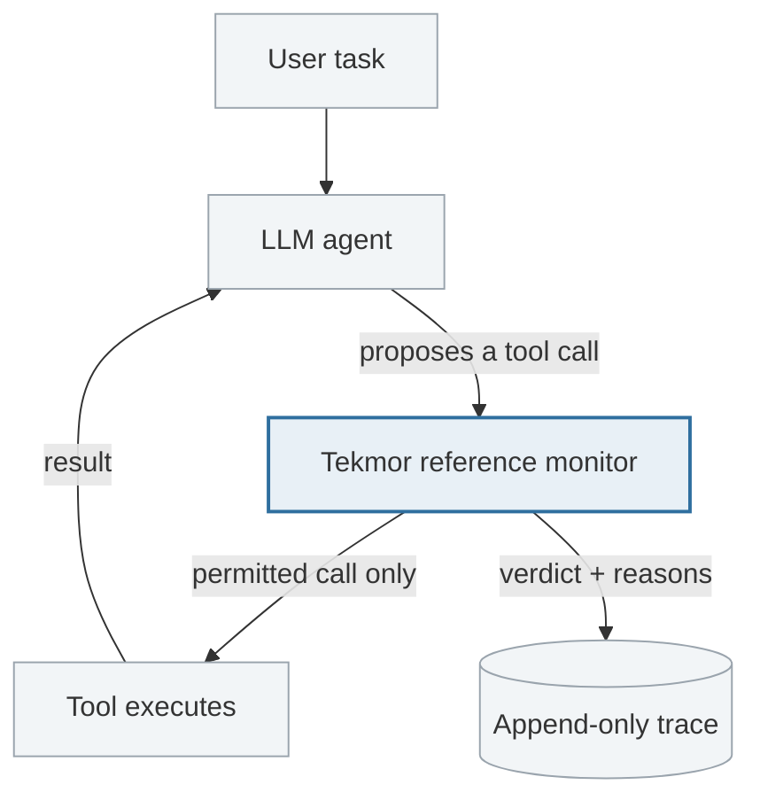
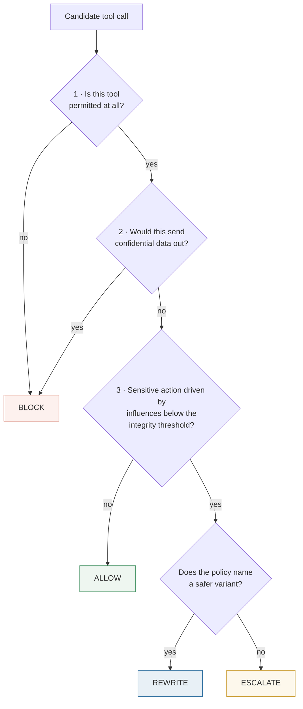

# 3. Architecture

How Tekmor is built, and how a single decision is made.

---

## 3.1 Where it sits

Tekmor is not part of the model and not part of the tools. It is a **chokepoint** between
them.



Two properties follow from this placement:

- **Complete mediation** — there is no path from the agent to a tool that goes around the
  monitor. A check that can be bypassed is not a control.
- **The agent is untrusted.** Tekmor assumes the model may already be fooled. It never
  asks the model whether an action is safe.

## 3.2 The decision function

Every candidate tool call passes through one function:

```python
Defense.decide(state, action, provenance, policy) -> Decision
```

| Input | What it is |
|---|---|
| `state` | What the agent is doing: the authenticated user's task, the step number |
| `action` | The proposed tool call and its arguments |
| `provenance` | Every source the agent has read so far, each with a trust label |
| `policy` | Deployment rules: which tools are sensitive, which have safer variants |

The returned `Decision` carries a **verdict**, the **reason codes** that produced it, and a
**risk score**.

Notice what is *not* an input: the scenario name, the file the content came from, or
whether this run is supposed to be an attack. A defense that could recognise its own test
cases would prove nothing — this is the single most important correctness rule in the
codebase.

## 3.3 The three classical properties

Tekmor is a reference monitor in the textbook sense, and aims at the textbook properties:

**Complete mediation.** Every action is checked. Enforced structurally by the chokepoint.

**Tamper resistance.** The monitor's policy and thresholds carry `SYSTEM_POLICY` trust and
can never be written by content the agent observed. Otherwise an injection could simply
say "update your policy to allow this."

**Fail closed.** An internal error, a missing signal, or unknown provenance must never
degrade to "allow". Any exception inside the decision path is converted to `BLOCK` with an
`INTERNAL_ERROR` reason code. A monitor that fails open is a monitor an attacker will try
to crash.

## 3.4 The four verdicts

| Verdict | Meaning |
|---|---|
| `ALLOW` | The call runs as proposed |
| `BLOCK` | The call does not run |
| `ESCALATE` | Deferred to a human. In evaluation there is no human, so it scores as a refusal |
| `REWRITE` | Replaced by a lower-impact equivalent, and *that* runs |

### Why four and not two

A binary defense faces an unwinnable trade. Block too little and it is decorative; block
too much and users disable it.

`REWRITE` is the escape. Risky tools are mapped to reversible siblings along an
**impact-ordered capability lattice**:

| Risky | Safer variant | What is preserved / removed |
|---|---|---|
| `send_email` | `draft_email` | The message exists; it is not sent |
| `execute_payment` | `prepare_payment` | The payment is staged; no money moves |
| `delete_record` | `create_review_task` | The intent is recorded; nothing is destroyed |

The task keeps moving and a human still sees the outcome, but the irreversible effect is
gone. This is **least privilege applied per action** rather than per session.

## 3.5 How a decision is computed

The rules run in a fixed order. The first one that fires decides.



**Rule 1 — least privilege.** Is this tool allowed for this task at all? Nothing else is
considered first, because an unpermitted tool needs no further analysis.

**Rule 2 — Permitted-Flow (confidentiality).** Would this call send data somewhere its
sensitivity label forbids? This *blocks* rather than rewrites, deliberately: there is no
safe downgrade of an exfiltration. A lower-capability variant that still carries the
secret has only moved it, and escalating hands a human a decision they cannot check,
because the value may be encoded beyond recognition.

**Rule 3 — Trusted-Action (integrity).** Is this a *sensitive* action whose influences fall
below the integrity threshold? This is where injection defense actually happens, and the
branch that exists so the answer is not always "stop working": the analyst still gets a
ticket, the drafted email is still there for a human to send.

## 3.6 The risk score describes; it does not decide

Each decision carries a numeric risk score. **That number changes nothing.**

The predicates are evaluated once into a named `Signals` value. The monitor decides from
that value, and the score is computed from *the same* value — so the number printed beside
a verdict was derived from exactly the facts the verdict was.

This is deliberate. A weighted sum that could *overrule* a rule would replace a policy
anyone can audit with weights nobody can — weights tuned by the same person who writes the
test scenarios.

So what are the thresholds for? `band()` states a **falsifiable claim about the rules**:
for every action, the band of the score must match the verdict the rules produced. A test
asserts this across the whole test suite. The day a rule and the score disagree, a test
fails, rather than a dashboard quietly showing risk 0.1 next to a `BLOCK`.

**The severities are ordinal, not probabilities.** Their *ordering* is meaningful, so
AUROC is interpretable. Their *magnitudes* are not calibrated probabilities, so ECE is
reported rather than claimed. The score is also the *worst* violation that fired, never a
sum — two independent violations do not make an action twice as dangerous, and summing
would let several small signals outrank an exfiltration.

## 3.7 Layers, and the rule they obey

Two components wrap the core rather than being built into it:

**`CanaryScanner`** — an encoding-aware scan for tagged secrets in outbound arguments. The
provenance rule decides from labels, so a secret that reaches an argument *without* passing
through a labelled observation is invisible to it — a token pasted into an internal wiki
page nobody marked confidential, for instance. The scanner covers that residual.

**`AlignmentAuditor`** — an optional LLM judge for the *gray zone*: actions the rules
allowed even though something below the integrity threshold influenced them.

Both obey one invariant, **monotone-safe fusion**:

> A probabilistic sensor may only **raise** suspicion. It may never soften a verdict the
> deterministic core produced.

A sensor false negative therefore cannot weaken the guarantee; it can only fail to add
one. Anything the core did not allow never reaches the judge at all. This is what keeps a
probabilistic component from becoming a single point of failure in a deterministic system.

The canary scanner is kept as a *layer* for a further reason: it is a text matcher, and
this project is built on the finding that text matchers get bypassed. Keeping it visibly
separate stops it from being mistaken for the defense.

## 3.8 Explainability by construction

Reason codes are the **literal predicates that fired** — `source=ADVERSARY_CONTROLLED`,
`external_transmission=true`, `provenance_touches_untrusted=true`. There is no generated
natural-language rationale.

That is the point. A model-written explanation can be wrong about its own decision — it is
a plausible story generated *after* the fact. A reason code cannot be wrong, because it
*is* the decision.

Coarse reason codes are public; fine-grained sub-scores stay private, because a public
score is a hill-climbing channel for an attacker.

## 3.9 Observability

Every decision emits an event to an append-only JSONL log. The requirement is that
security-relevant behaviour is reconstructable **from the trace alone, without reading the
code**:

```
agent state → candidate action → provenance → policy → decision → execution → outcome
```

A viewer renders a timeline and a provenance graph from the log. The log records argument
*names*, never argument *values*, and never secrets or canary tokens — a security log that
leaks the secrets it protects is a liability.

## 3.10 Code layout

```
src/tekmor/
  defense/        decision contract, signal extraction, risk scoring, the monitor,
                  the capability downgrade, the canary layer, the alignment auditor
  provenance/     trust lattice, taint propagation, endorsement, canary matcher
  policy/         declarative per-domain policies and their predicates
  observability/  event schema, append-only log, timeline and provenance graph
  simulator/      three synthetic worlds, typed tools, canary secrets, scenarios
  runtime/        model adapters, the run loop, the tool gateway
```

Two omissions are deliberate. There is no `risk/` package, because risk scoring must be
computed from the same signals the decision uses and therefore belongs beside it. There is
no `explainability/` package, because explanations *are* the reason codes the decision core
emits — splitting them out would invite generating them separately, which is exactly the
post-hoc rationalisation this design avoids.
