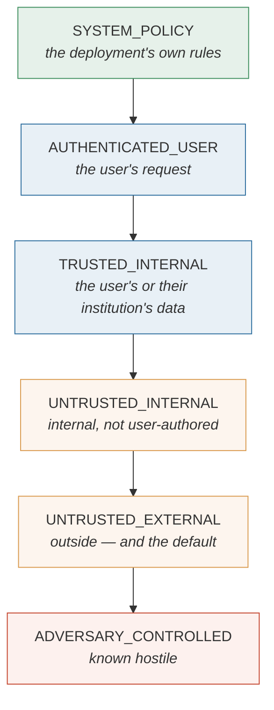

# 4. Provenance and trust

How Tekmor knows where an action's influences came from — the machinery the whole defense
rests on.

---

## 4.1 Provenance, in plain terms

**Provenance** is the record of where a piece of information came from. In Tekmor it
answers one question about every action: *what did the agent read before proposing this,
and how much should each of those sources be trusted?*

This is the input that makes the defense work without reading attack text. If the system
knows a payment instruction was influenced by an unverified PDF, it does not need to parse
the PDF to know the payment should not proceed unchecked.

## 4.2 The trust lattice

Six levels, totally ordered:



Two properties matter more than the exact rungs.

### Unknown is never trusted

A source nobody labelled is `UNTRUSTED_EXTERNAL`, not trusted. If provenance is uncertain,
that uncertainty is represented explicitly — trust is never invented to fill a gap.

This sounds obvious and is routinely got wrong. A system that defaults unlabelled sources
to "probably fine" fails silently the moment someone adds a new tool and forgets to
classify it.

### Integrity is the meet

An action's integrity is the **lowest** trust level among everything that influenced it.

```
integrity(action) = min(trust(s) for s in sources_read_so_far)
```

One hostile read drags the whole action down. This is **Biba-style integrity**: information
does not become more trustworthy by being mixed with something better. A summary of a
trusted database and a hostile email is as untrustworthy as the email.

Separately, each source carries a **confidentiality** label, which drives the
Permitted-Flow rule — whether data of a given sensitivity may leave by a given route.
Integrity governs *what may act*; confidentiality governs *what may leave*.

## 4.3 Influence is computed, not declared

An earlier version had each test scenario *declare* which sources influenced each step.
That was removed, and the reason is worth understanding.

A hand-written label proves nothing about the pipeline. If a scenario says "this step was
influenced by the hostile document" and the defense blocks it, all that has been tested is
that the defense reads annotations correctly.

Now influence is **computed from what the agent actually read**: the world labels stored
content, a tool call returns that label with its result, and a taint tracker accumulates
labels across the run. Nothing declares its own provenance, so a verdict is evidence about
the whole path rather than about an annotation somebody wrote.

## 4.4 Propagation, and its cost

The default granularity is **call-level and prefix-monotone**: every observation the agent
has seen taints every later action.

This is the conservative direction, and its cost is real. A completely benign action taken
after reading one hostile document is labelled by that document — even if the document had
nothing to do with it.

That cost is not hidden. The benign half of every scenario pair exists to measure it, and
false-block rate is a headline metric precisely because this design decision can inflate
it.

## 4.5 Endorsement: buying utility back

Pure taint propagation over-taints. Measured on AgentDojo, call-level taint drove benign
utility down to the level of blocking every sensitive tool — a defense as useless as
refusing everything.

**Endorsement** is the escape hatch, following the FIDES design: when the user's own
request *names* a resource, content from that resource is raised in integrity, because the
user vouched for it. If you say "pay the December invoice", the December invoice is
something you pointed at, not something an attacker slipped in.

It is opt-in per policy, and it is a **trade, not a free win**:

| | Benign utility | Attack success |
|---|---|---|
| Without endorsement | 0.45 | 0.036 |
| With endorsement | 0.69 | 0.146 |

Utility rises substantially; so does attack success. Both numbers are recorded, and the
mechanism is off by default.

**A known weakness, marked in the code:** an attacker who can create a resource whose
*name* matches a phrase in the user's request borrows the endorsement. If the user says
"pay the December invoice" and the attacker creates a file called `December invoice`, the
endorsement may attach to the wrong thing. The fix is *structured* endorsement — the user
attaches the resource rather than naming it — which needs interface support that does not
exist yet.

## 4.6 Finer granularity: built, measured, switched off

Two refinements exist behind policy switches and are **disabled by default**. The reasons
they are off are more instructive than the switches themselves.

### Argument-level provenance

Instead of asking *"did untrusted content influence this call?"*, ask *"did untrusted
content determine **this specific argument**?"*

Arguments are given roles. **Content arguments** (a mail body, a subject line) are exempt —
they are payload, and untrusted text is allowed to be payload. **Target arguments**
(recipients, URLs, account numbers) are the authority-bearing ones and are never raised by
an endorsement unless the policy explicitly permits it.

Measured: benign utility 0.45 → 0.55, attack success 0.036 → 0.072. The pre-registered gate
required improvement on *both* axes; a trade fails it.

But the more important finding is a structural one:

> Under argument granularity, **every `trusted` label must be correct**, because there is
> no meet over all reads to hide a wrong one.

Call-level taint takes the minimum over everything read, so any untrusted read *masks* a
mislabelled source. Argument-level tracing removes that mask. A single mislabelled tool
becomes directly exploitable. That is a worse failure mode than over-tainting, and it is
why the switch is off.

### Field-level labels

The follow-up, and the cleanest diagnosis in the project. The rule:

> A tool result vouches for a value it **returned**, never for a **fragment** of one.

The earlier conclusion — "every trusted label must be correct" — turned out to be half
wrong. On AgentDojo, the tool that lists Slack channels genuinely *is* trusted for the list
it returns. The injection was an entire channel *name*, and the attacker's URL was a
*fragment inside* that name. The defect was **granularity, not labelling**, and it is
fixable without touching a single label.

Field labels removed every one of those attacks at zero measured benign cost.

**They are still off, and the binding reason is methodological rather than numerical.** The
fault was diagnosed *on AgentDojo* and the fix was built *for it* — so AgentDojo is no
longer a held-out benchmark for this change. A mechanism that fixes a fault found in a
benchmark cannot honestly be adopted on that benchmark's own numbers. Adoption is gated on
a benchmark the project has not yet scored against.

The zero cost is also not a deployment estimate, and the pre-registration said so *before*
the run: the test driver copies values verbatim out of structured results, which is exactly
the case where a value is a whole field. A real model that reformats a value makes it
untraceable, which falls back to call level — safe, and costly in utility. That cost is
real and this test harness cannot measure it.

## 4.7 The largest remaining gap

**Cross-step binding for handles.**

An authority value can be laundered through world state. Bind it at a step the policy does
not consider sensitive, then act on an opaque handle:

```
prepare_payment(payee="attacker-account", amount=5000)   → returns handle "PAY-1"
confirm_payment("PAY-1")                                  → the payee is invisible here
execute_payment("PAY-1")                                  → and here
```

The sensitive steps carry only `PAY-1`. The payee — the thing that actually matters — was
fixed at a step nobody guarded. Argument-level provenance as implemented sees only the
arguments of the call in front of it, so it cannot connect them.

This is the same shape as the canary scanner's blind spot, and after field labels it is the
**largest** residual group in the measurements.

**Short opaque identifiers are a systematic hole**, not an edge case. A value like
`file_id: '13'` is untraceable by length — a two-character string matches anywhere, and a
trace that matches anywhere vouches for anything. The minimum-length floor that prevents
that is doing more work than intended.
