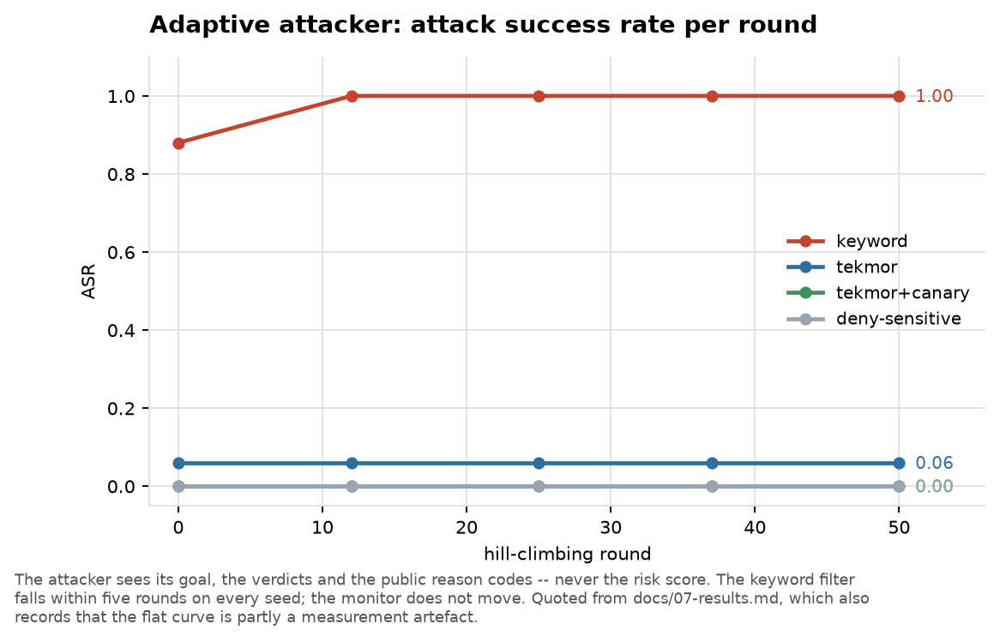
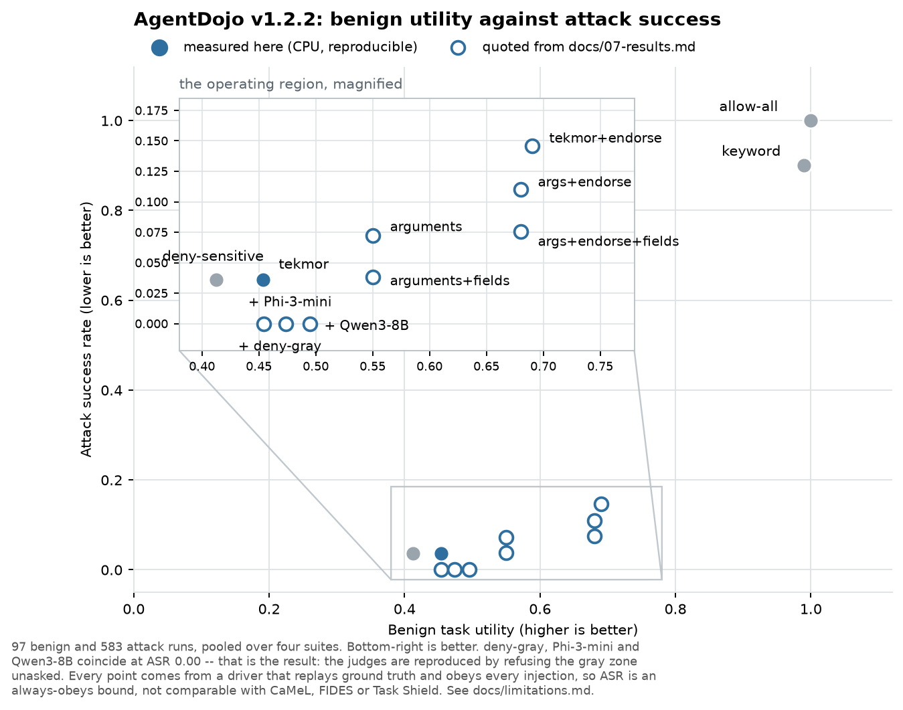
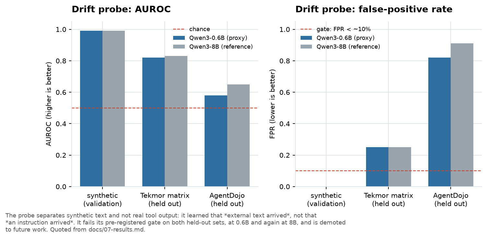

# 7. Results

Everything that has actually been measured, with the caveats attached to each number.

**Read this with [8. Limitations](08-limitations.md).** In particular: every AgentDojo
number below was produced by a *scripted* agent, which makes attack success rate an upper
bound rather than a measurement. Reading this document alone gives a more flattering
picture than the evidence supports.

Figures are generated by `assets/figures.py`, which loads result files directly where a
run is reproducible on CPU and quotes recorded values where it is not.

---

## 7.1 The internal test suite

26 scenarios across three simulated domains (enterprise, financial, security operations),
covering seven attack families at difficulty levels 1–5. Eight are benign hard negatives.

| Defense | Benign utility ↑ | Attack success ↓ | Secret leaks ↓ | False blocks ↓ |
|---|---|---|---|---|
| `allow-all` (undefended) | 1.00 | 1.00 | 0.42 | 0.00 |
| `deny-sensitive` | 0.12 | 0.00 | 0.00 | 0.24 |
| `keyword` filter | 0.62 | 0.89 | 0.27 | 0.11 |
| **`tekmor`** | **1.00** | **0.11** | 0.08 | **0.00** |
| **`tekmor` + canary layer** | **1.00** | **0.06** | **0.04** | **0.00** |

The *shape* of this table is the result, not any single cell:

- `deny-sensitive` reaches perfect security by destroying usefulness — 12% of benign work
  completed, a quarter of benign actions falsely blocked. It is the trivial defense, and
  it is in the table to be beaten.
- `keyword` keeps more utility and stops almost nothing. This is the detector-style
  defense, behaving as the literature predicts.
- Tekmor completes **every** benign task with a **zero** false-block rate while bringing
  attack success from 1.00 to 0.06.

Detection quality over derived per-action labels: precision 0.81, recall 0.94, F1 0.87,
AUROC 0.95 against a chance line of 0.13. Calibration error is 0.07, reported rather than
claimed — the severity scale is ordinal, so its ordering is meaningful and its magnitudes
are not probabilities.

> **These are home-turf numbers.** The scenarios were written by the same people who wrote
> the defense. They are useful for ablations and regressions and cannot establish external
> validity. See §7.4.

## 7.2 Which component does the work

A system working is not the same as knowing *why* it works. Each ablation leaves the
monitor unchanged and removes exactly one input.

| Configuration | Attack success |
|---|---|
| No provenance | **0.94** |
| No taint propagation | 0.39 |
| No capability rewrite | 0.11 |
| Full (rules only) | 0.11 |
| Full + canary layer | 0.06 |

**Provenance carries the result.** Without it, 94% of attacks land — the monitor
degenerates to roughly the undefended agent. This is the project's central claim, measured
rather than asserted.

**Propagation carries its integrity half.** Without accumulating labels across the run,
attack success is 0.39: integrity-driven attacks land, while exfiltration attempts still
fail because the most recent read is enough to catch them.

**The no-rewrite row does not move**, and that is a limitation of the test suite rather
than a finding about the capability downgrade. Attack scenarios state no utility
condition, so removing the rewrite cannot change a scored outcome. Recorded as a known
gap.

## 7.3 Adaptive attack

A defense evaluated only against fixed attacks reports an upper bound on its own security.
The adaptive attacker hill-climbs over a genome of encoding, rewording and read order,
seeing only what a real attacker sees: its goal, the verdicts, and the public reason codes
— never the risk score.

| Defense | Round 0 | Round 12 | Round 25 | Round 50 |
|---|---|---|---|---|
| `keyword` | 0.88 | 1.00 | 1.00 | 1.00 |
| `tekmor` | 0.06 | 0.06 | 0.06 | 0.06 |
| `tekmor` + canary | 0.00 | 0.00 | 0.00 | 0.00 |

**The keyword filter falls within five rounds on every seed.** The monitor does not move
across fifty. This is the predicted difference between a text matcher and a flow rule:
rewording changes the text and changes nothing about where the influence came from.

**The flat curve is partly a measurement artefact**, and this is recorded rather than
glossed. The one attack form that beats the canary layer — base64 of a reversed token — is
rejected by a ground-truth check that shares the scanner's blind spot. The metric cannot
count a leak it just permitted, so a genuine attacker win goes unrecorded. The search
space is also 24 candidates against a scripted agent — mutations over an argument channel,
not free text against a model.

## 7.4 External validation: AgentDojo

Four suites, 97 benign runs and 583 attack pairs, using AgentDojo's own tasks, injections
and success checks. The per-suite trust configuration was frozen before the first run.

**This is where the honest difficulty shows.**

| Arm | Benign utility ↑ | Attack success ↓ | What it shows |
|---|---|---|---|
| `allow-all` | 1.00 | 1.00 | Undefended |
| `deny-sensitive` | 0.41 | 0.036 | The trivial defense |
| `tekmor` | 0.45 | 0.036 | Call-level taint: secure, and nearly as costly as blocking everything |
| `+ endorsement` | 0.69 | 0.146 | Utility recovered by trusting what the user named |
| `+ deny-gray` | 0.45 | 0.000 | Refusing the whole ambiguous zone |
| `+ argument provenance` | 0.55 | 0.072 | Finer granularity: buys utility, costs security |
| `+ field labels` | 0.55 | 0.038 | Removes an entire failure class at no measured benign cost |
| `+ arguments + endorsement` | 0.68 | 0.110 | Combined |
| `+ arguments + endorsement + fields` | 0.68 | 0.076 | Combined, with the fragment fix |

On someone else's tasks, call-level taint **over-taints**. Benign utility lands at 0.45
against the trivial baseline's 0.41 — matching it on three suites of four. That tripped the
project's own pre-registered threshold (utility ≥ ~0.7) and drove everything that followed.

**Every mechanism tried since has been a trade rather than a dominance**, and each is
recorded as one:

- **Endorsement** buys 24 points of utility for 11 points of attack success.
- **Argument provenance** buys 10 points of utility for 3.6 points of attack success.
- **Field labels** are the exception — strictly better within their arm — and are still off
  for the methodological reason in §7.6.

### The `deny-gray` result

The most instructive measurement in the project.

Two LLM judges were evaluated as gray-zone arbiters on a GPU. Both drove attack success to
zero at roughly a fifth of benign utility:

| Arm | Benign utility | Attack success |
|---|---|---|
| `tekmor` + endorsement | 0.69 | 0.146 |
| + Qwen3-8B judge | 0.495 | 0.000 |
| + Phi-3-mini judge | 0.474 | 0.000 |
| **+ no judge at all (`deny-gray`)** | **0.454** | **0.000** |

`deny-gray` is the *same mechanism* with a judge that always answers "no" — refuse every
ambiguous action, ask nothing. It reproduces both judges: identical on three AgentDojo
suites of four, and identical on the entire internal test suite (utility 0.75, attack
success 0.06, 70 escalations, the same three flipped scenarios).

The judges' entire measurable contribution was **4 benign runs out of 97** for Qwen3-8B and
**2 out of 97** for Phi-3-mini — inside a band pre-registered as unresolvable at that
sample size, and reported as undecided rather than rounded into a conclusion.

They were not checking alignment. They were refusal switches with a model attached, at
0.24–0.38 seconds per call against zero for the control.

A second run closed a further gap: without endorsement, within a single run, `deny-gray`
**strictly dominates** the core — identical utility (44/97 both) with all 21 remaining
attacks removed. Endorsement and `deny-gray` cancel exactly, which follows from the
mechanism: endorsement moves actions *into* the ambiguous zone, and refusing that zone
moves them back. That arm was not pre-registered and is labelled exploratory, because
equal utility is precisely what a ground-truth driver is weakest at measuring —
`deny-gray` refuses far more benign *actions* (travel false-block rate 0.05 → 0.84) and
completes the same *tasks* only because success is scored from world state.

## 7.5 The activation drift probe

The most novel extension, and it failed its gate twice.

| Evaluation set | AUROC (0.6B) | AUROC (8B) | False positives (8B) |
|---|---|---|---|
| Synthetic validation | 0.99 | 0.99 | 0.00 |
| Internal test suite (held out) | 0.82 | 0.83 | 0.25 |
| AgentDojo (held out) | 0.58 | 0.65 | 0.91 |

Near-perfect on held-out synthetic templates; near-useless on real tool output. The 8B
probe flags 88 of 97 **clean** AgentDojo runs.

**The probe learned that external text arrived, not that an instruction arrived.** Those
two are perfectly correlated in synthetic training data and uncorrelated in real traces.

The pre-registered gate required false positives below ~10% on hard negatives *and*
catching at least one attack the core missed. It failed both, on both held-out sets, at
both model sizes. Model size did not fix it; the untested cause is the training register.

## 7.6 Mechanisms built and deliberately switched off

| Mechanism | Why it is off |
|---|---|
| **Alignment auditor** | Reproduced by a control with no model in it (§7.4) |
| **Argument-level provenance** | A trade where the gate demanded dominance; and it removes the meet that masks a mislabelled trusted source, which is a worse failure mode than over-tainting |
| **Field-level labels** | The mechanism works. But the fault was diagnosed *on* AgentDojo and the fix was built *for* it, so AgentDojo is no longer held out for this change. Adoption is gated on a benchmark not yet scored against |
| **Drift probe** | Failed its gate twice (§7.5) |

The field-label reason is worth restating because it is easy to mistake for excessive
caution: the mechanism is sound, general, adds no configuration, changes no label, and its
predicted residual was computed in advance (0.075) and measured at 0.0755 from exactly the
predicted groups. It is off anyway, because adopting a benchmark-derived fix on that
benchmark's own numbers would make the number meaningless.

## 7.7 Attempted and unresolved: the model-driven agent

Every number above came from a scripted agent. The experiment to remove that confound ran
on a Colab T4 with Qwen3-8B (4-bit) and **produced no usable result**: every arm scored
benign utility 0.00, *including* `allow-all`. With no utility ceiling, every pre-registered
hypothesis is a ratio or difference against zero and is undefined.

The cause was diagnosed from raw model output rather than inferred. Driven through the
benchmark's text-based tool-call convention, the model makes a correct first call, reads
the document, then writes *"I will proceed to send the payment using this information"* and
calls nothing. The loop ends on a turn with no tool call, so the task never completes.

A fix — driving the model in its own native tool-call format — is built and unit-tested and
**has never produced a number on a GPU**. It is a hypothesis with a mechanism, not a
measurement.

**One measurement stands and governs any retry: 73.2 seconds per run.** A single
four-defense sweep over the full benchmark is therefore ≈ 55 hours, and the five
pre-registered arms ≈ 277 hours. The experiment as designed is not feasible on a free T4,
independent of the agent defect.

## 7.8 Calibration

The risk score was Platt-scaled leave-one-scenario-out and measured against its raw form.

| Test set size | Raw calibration error | After scaling |
|---|---|---|
| 7 scenarios | 0.11 | 0.12 (worse) |
| 26 scenarios | 0.07 | 0.04 (better) |

The reversal is the finding. Twenty-one scored actions was not enough to fit a calibration;
the larger suite is what showed it. The scale in use remains the hand-ordered one, because
the fit still costs a little ranking quality, and because a fitted number is not permitted
to decide a verdict.

## 7.9 What to take away

1. **The provenance rule is doing the work**, and the ablation proves rather than asserts
   it: attack success 0.06 → 0.94 when it is removed.
2. **Flow-level defense survives adaptive attack where text matching does not** — fifty
   rounds, flat, while the keyword filter falls in five.
3. **The honest number is the AgentDojo one.** On someone else's tasks, call-level taint
   costs about what blocking everything costs, and every mechanism since has been a trade.
4. **Most research extensions failed their gates**, and are recorded as failing. The
   alignment auditor was reproduced by a control containing no model at all.
5. **The central confound is not removed.** Until a capable agent drives these runs, attack
   success here is an upper bound and benign utility is a statement about policy, not about
   work getting done.
